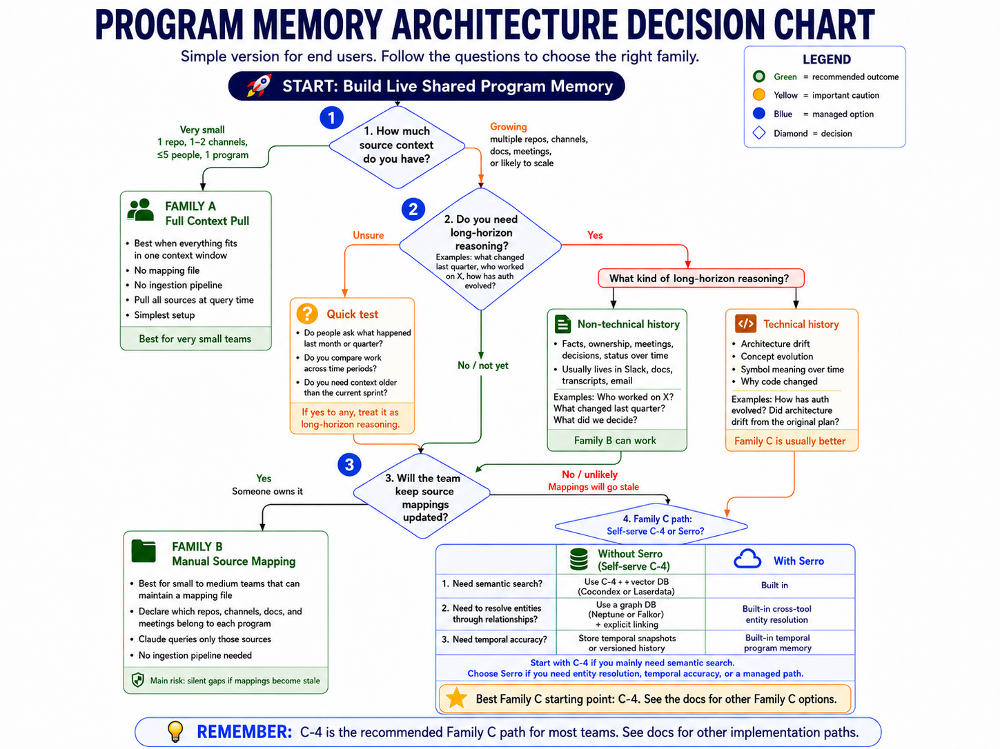

# Build Your Own Program Memory Layer

> A starter kit for building live shared program memory using Claude Code, MCP integrations, and git — no proprietary infrastructure required.

> **This repo covers Levels 1–3 (pull, map, loop).** The proactive layer, widget layer, and graph index are out of scope. See the [scope table](#scope) below.

> **This repo contains step-by-step instructions, not code.** There is nothing to `npm install` or `docker run`. Each family folder is a guide for how to build the implementation yourself using Claude Code and native MCP integrations.

[]()
[](LICENSE)
[]()

---

## Why Serro published this

We want our customers to succeed — with or without us.

If you have the engineering bandwidth to build and operate your own live program memory, this repo gives you the full architecture for Levels 1–3: every decision point, every tradeoff, every dead end we found. You'll know exactly what you're signing up for.

If, after reading this, you'd rather not operate it yourself — [Serro](https://serro.ai) is the managed version. It goes well beyond what's in this repo: managed infrastructure, entity resolution, temporal program intelligence, enterprise controls, and production-grade integrations.

Either way, you'll have made an informed choice. That's the goal.

---

## What is live program memory?

An AI-native engineering org runs multiple programs in parallel - each with its own scope, stakeholders, signals, and decisions. Live program memory means every AI agent in your org can answer questions like:

- *"What decisions did the platform team make last quarter and why?"*
- *"Which engineers have been working on auth - and for how long?"*
- *"What action items from last week's design review are still open?"*
- *"Has the scope of Program X drifted from its original charter?"*

Without live program memory, every Claude session starts from zero. Engineers re-explain context. Decisions get repeated. Work happens invisibly.

[Serro](https://serro.ai) solves this by maintaining a continuously updated, program-indexed memory across GitHub, Slack, Google Drive, and meetings - and making it queryable by any agent in the org.

This repo documents how to build the **memory layer foundation** using Claude Code and native MCP integrations.

---

## Scope

| | This repo | Serro |
|---|---|---|
| Level 1 — Full Context Pull | ✅ Documented | ✅ |
| Level 2 — Manual Source Mapping | ✅ Documented | ✅ |
| Level 3 — Auto-Ingestion Loop | ✅ Documented | ✅ |
| Level 4 — Semantic/graph index | ⚠️ Pointers only (CocoIndex, LaserData, FalkorDB) — not validated | ✅ Built-in |
| Proactive monitoring layer | 🔴 Out of scope | ✅ |
| Action item follow-through | 🔴 Out of scope | ✅ |
| Widget layer | 🔴 Out of scope | ✅ |
| Entity resolution across tools | 🔴 Out of scope | ✅ |
| Temporal program intelligence | 🔴 Out of scope | ✅ |
| Managed infrastructure | 🔴 Out of scope | ✅ |

---

## What you're building

```
┌─────────────────────────────────────────────────────┐
│  Widget layer       Prompt-based live views of       │
│                     program state (requires layer 2) │  ← out of scope
├─────────────────────────────────────────────────────┤
│  Proactive layer    Autonomous loop agent monitors   │
│                     programs, flags blockers, posts  │  ← loop pattern (see below)
│                     digests on a schedule            │
├─────────────────────────────────────────────────────┤
│  Memory layer       Signals from GitHub/Slack/Drive  │
│                     organized by program, queryable  │  ← this repo
│                     by any Claude session            │
└─────────────────────────────────────────────────────┘
```

**This repo covers the memory layer in full.** The proactive layer is documented as a loop pattern — an autonomous Claude agent that wakes up on a schedule, reads program memory, and surfaces what matters without being asked. See [`content_ideas/serroloop_blog_post.md`](content_ideas/serroloop_blog_post.md) and the [loop pattern](#what-is-a-loop) concept below. The widget layer remains out of scope.

---

## Four levels of live program memory

There are four levels. Each one is useful on its own. Each one is also the foundation for the next.

| Level | What you do | What you get | Families |
|---|---|---|---|
| **1 — Pull** | Nothing. Claude pulls all sources at query time. | Instant setup. Works until context fills up. | Family A |
| **2 — Map** | Maintain `program_mappings.yaml` — programs, people, sources in one file. | Scoped queries, contributor attribution, action item follow-up. | Family B |
| **3 — Loop** | A Claude loop automaintains the digests. | Always-current memory. No manual maintenance. | Family C (C-4 start) |
| **4 — Graph** | Pipe loop output into a semantic/graph index. | Semantic search. Entity resolution. Temporal reasoning. | Family C + [CocoIndex](family_c/cocoindex_upgrade.md) / [LaserData](family_c/laserdata_upgrade.md) / FalkorDB / Serro |

**Start at Level 3.** One `/loop` command, no infrastructure required. Move to Level 4 only after your loop is stable and you're hitting the ceiling of flat digest queries. The mapping file (`program_mappings.yaml`) is the same at every level — you write it once and it carries forward.

See [`verdict.md`](verdict.md) for the full rationale and when to use each level.

Full decision tree: [`memory_layer_decision_chart.md`](memory_layer_decision_chart.md)



---

## What Serro does that this can't (yet)

This is an honest comparison. The open-source version covers Levels 1–3 — but Serro goes further:

| Capability | Open-source (this repo) | Serro |
|---|---|---|
| Live memory ingestion | ✅ Hourly–seconds depending on Family C option | ✅ Continuous, event-driven |
| Program-indexed memory | ✅ Via `program_mappings.yaml` | ✅ Auto-classified, org-wide |
| Keyword search across sources | ✅ Via MCP (GitHub, Slack, Drive) | ✅ |
| Semantic / embedding search | 🔴 Out of scope | ✅ Built-in |
| Temporal code intelligence | 🔴 Out of scope | ✅ |
| Engineer contribution history | 🔴 Out of scope | ✅ |
| Voice-driven memory updates | 🔴 Out of scope | ✅ |
| Proactive program coordination | 🔴 Out of scope | ✅ |
| Zero-config setup | ❌ Requires mapping yaml + MCP server setup | ✅ |

The open-source version covers the memory layer. Serro's proprietary ontology and the capabilities built on top of it are out of scope for this repo.

---

## Current status

| Layer | Status | Notes |
|---|---|---|
| Memory layer | 🟢 Instructions written | Three architectures documented with step-by-step guides. Not validated against a real org. |
| Proactive layer | 🟡 Loop pattern documented | Serroloop pattern covers monitoring, digest, and blocker detection. Implementation guide not yet written. |
| Widget layer | 🔴 Out of scope (checkpoint 1) | Requires memory + proactive layers |

**Checkpoint 1 complete:** capability analysis, architectural decision tree, and implementation options documented.  
**Checkpoint 2:** build Family B or C2 against a real org and measure classification accuracy, coverage, and latency.

---

## Quick start

**1. Pick your level**

Read [`verdict.md`](verdict.md). It has a single table: setup time, what you get, when to move up. Most teams should start at Level 3 (one `/loop` command). If you're a small org or want the simplest possible start, Level 1 or 2 first.

**2. Follow the implementation guide for your level**

| Level | File |
|---|---|
| Level 1 — Full Context Pull | [`family_a/instructions.md`](family_a/instructions.md) |
| Level 2 — Manual Source Mapping | [`family_b/instructions.md`](family_b/instructions.md) |
| Level 3 — Auto-Ingestion Loop | [`family_c/c4_loop.md`](family_c/c4_loop.md) (recommended) or [`family_c/instructions.md`](family_c/instructions.md) for all options |

**3. Copy the templates**

`templates/program_mappings.yaml`, `templates/charter.md`, and `templates/CLAUDE_template.md` — fill in your org's programs, sources, and owners.

**Before you build, read these:**
- [`critical_review.md`](critical_review.md) — this repo has a conflict of interest; the review names the biases explicitly
- [`comparative_analysis.md`](comparative_analysis.md) — MCP is pull-only, not a continuous stream; several architectural assumptions fail because of this
- [`family_b/overview.md`](family_b/overview.md) — Family B has 6 known limitations; long-horizon technical reasoning is the hardest gap to close

---

## Repo structure

```
├── LICENSE                              ← Apache 2.0
├── README.md                            ← you are here
├── CLAUDE.md                            ← agent navigation (read if you're an AI)
├── verdict.md                           ← level selection: setup time, capabilities, tradeoffs
├── critical_review.md                   ← conflict of interest notice; read before building
├── comparative_analysis.md              ← what broke in earlier designs; key architectural fork
├── key_decisions.md                     ← 8 memory-layer decision points (9–13 = out of scope)
├── memory_layer_decision_chart.md       ← mermaid decision tree for picking an approach
│
├── research/
│   └── serro_capabilities.md            ← 2 in-scope capabilities; scope boundary defined
│
├── family_a/
│   └── instructions.md                  ← Level 1: full context pull — micro-orgs, zero config
│
├── family_b/
│   ├── overview.md                  ← human-maintained source mapping approach
│   └── instructions.md             ← step-by-step setup
│
├── family_c/
│   ├── overview.md                  ← auto-ingestion: C1 / C2 / C3 / C4 comparison
│   ├── c1_webhook_server.md         ← always-on server (seconds latency)
│   ├── c2_git_cron.md               ← git + scheduled cron (hourly, recommended start)
│   ├── c3_github_actions.md         ← GitHub Actions + Cloudflare Worker (1–2 min)
│   ├── c4_loop.md                   ← Claude Code loop (simplest, recommended)
│   ├── cocoindex_upgrade.md         ← Level 4 pointer (out of scope — see scope note inside)
│   ├── laserdata_upgrade.md         ← Level 4 pointer (out of scope — see scope note inside)
│   └── instructions.md             ← shared setup steps + option comparison
│
├── templates/
│   ├── program_mappings.yaml
│   ├── charter.md
│   └── CLAUDE_template.md
```

---

## Concepts

- [What is a program?](#what-is-a-program)
- [What is program engineering?](#what-is-program-engineering)
- [What is an agentic TPM?](#what-is-an-agentic-tpm)
- [What is live program memory?](#what-is-live-program-memory-1)
- [What is a loop?](#what-is-a-loop)
- [Why not just use Jira, Linear, or Notion?](#why-not-just-use-jira-linear-or-notion)
- [What is MCP and why does it matter here?](#what-is-mcp-and-why-does-it-matter-here)

---

### What is a program?

A program is a named, ongoing technical initiative with a defined scope, a set of owning engineers, and signals distributed across multiple tools. Unlike a ticket (which tracks one task) or a project (which has a hard end date), a program is continuous. It has a charter, stakeholders, and a living record of decisions, commitments, and scope changes.

Examples: "Platform Reliability", "Auth Modernization", "AI Discoverability", "Mobile Launch Q3".

---

### What is program engineering?

Program engineering is what happens when multiple workstreams all point at the same outcome and none of them, fixed in isolation, achieves it. A program gives that work a name, an owner, a sequence, and honest visibility into whether it's on track. Unlike a project, it doesn't end — it recurs. And every time it runs without a shared memory of how it ran before, the coordination cost compounds from scratch.

Program engineering used to be a large-company problem. You hit it somewhere around 80 engineers when the org got complex enough that coordination started breaking down. Before that, a good senior engineer or EM could hold the picture in their head.

That threshold is gone.

AI has decoupled team size from execution capacity. A 10-person engineering team today can move at a speed and breadth that would have required 80 people five years ago. The ambition expands to meet the new capacity. And the moment you're running eight things at once with a team of ten, you have an 80-person company's coordination problems with none of the organizational infrastructure that large companies built to handle them.

This is the shift from product engineering to program engineering. When a program has no name, no owner, and no shared visibility, it still gets run — by whoever has enough context to hold the picture. That person becomes the accidental program engineer, doing it on top of their actual job, and all the institutional knowledge lives in their head.

And the workstreams themselves are no longer all human. With Anthropic's release of loops in Claude Code, agents stopped being tools you invoke and became standing participants in programs. A loop wakes up on its own schedule, reads program state, pulls signals, writes memory, posts digests, flags blockers — and decides for itself when to run again. Nobody is prompting it.

This is the primary use case of program engineering: programming the governance of human-agent loops. Which decisions a loop makes autonomously, which it escalates, what context it's allowed to act on, who reviews what it wrote while everyone was asleep, and who is accountable when it acts on stale memory. These are program-level decisions, not prompt-level ones. The team that writes its loops' governance explicitly — in the same mapping file that declares its programs' owners and sources — is doing program engineering. The team that doesn't has unaccountable workstreams running unattended.

[Read the full essay - Welcome to Program Engineering](https://serro.ai/blog/welcome-to-program-engineering)

---

### What is an agentic TPM?

An agentic TPM platform is infrastructure for program engineering - not a replacement for the TPM role. With live program intelligence, agentic actions, and self-driven reports, it surfaces program visibility for everyone driving the work so they spend less time coordinating and more time executing. It scales TPM capacity without scaling headcount.

It does this by:

- Continuously ingesting signals from GitHub, Slack, Drive, and meetings
- Maintaining a live model of each program's state: who's working on what, what decisions were made, what commitments are outstanding
- Surfacing blockers before they're escalated
- Following up on action items
- Routing context to downstream agents so they don't start from zero

[Serro](https://serro.ai) is an agentic TPM platform. This repo covers the open-source foundation — the memory layer — that an agentic TPM builds on top of.

---

### What is live program memory?

Live program memory is an always-current, program-indexed record of everything that matters to a program: decisions, contributors, scope changes, blockers, and action items.

"Live" means it updates automatically as signals arrive - not a static doc someone has to remember to update.

"Program-indexed" means signals are organized by program, not by tool or date. A question like "what changed about the auth program last quarter?" draws from GitHub, Slack, Drive, and meeting transcripts simultaneously.

This is the problem this repo is trying to solve.

---

### What is a loop?

A loop is an autonomous Claude agent that runs on a recurring interval. It wakes up, reads state, decides what matters, acts, and goes back to sleep — with no human prompting it.

Applied to program engineering, a loop is what turns passive memory into active oversight. The memory layer answers questions when asked. A loop running on top of it asks the questions itself:

- What PRs have been open longer than expected?
- What Slack decisions haven't made it into any doc?
- Which programs have gone quiet when they shouldn't have?
- Has scope drifted outside the declared charter?

The loop reads the serro-diy repo, pulls live signals from declared sources, compares current state against the last digest, and posts a summary to Slack — or flags specific items that need attention.

This is the **Serroloop pattern**: memory layer + autonomous loop = proactive program oversight that scales without headcount.

See [`content_ideas/serroloop_blog_post.md`](content_ideas/serroloop_blog_post.md) for the full pattern and implementation sketch.

---

### Why not just use Jira, Linear, or Notion?

Those tools track work at the ticket or document level. They don't maintain a cross-source model of program state over time. Connecting signals - a GitHub PR to a Jira ticket to a Slack decision to a meeting transcript - is still manual.

An agentic TPM does that connection automatically and makes the result queryable.

Jira answers: *"what's the status of this ticket?"*
An agentic TPM answers: *"what has changed about the auth program over the last quarter, and why?"*

---

### What is MCP and why does it matter here?

MCP (Model Context Protocol) is an open protocol that lets Claude connect to external tools - GitHub, Slack, Google Drive, meetings - and query them in real time. Instead of copy-pasting context into a chat window, Claude reads from live sources directly.

This repo uses MCP integrations as the data layer for all three implementation families.

The key constraint: **MCP is pull-only.** Claude reads from tools when asked; it does not receive a continuous stream of events. That single constraint shapes every architectural decision in this repo - it's why Family C (auto-ingestion) exists at all.

---

## Contributing

This is an open experiment. Contributions that advance it are welcome:

- **Measurements** - ran Family B or C2 against a real org? Classification accuracy, coverage, and latency numbers are the most valuable thing you can add.
- **Dead ends** - tried something that didn't work? Document it in `comparative_analysis.md`.
- **Implementation gaps** - `family_a/instructions.md`, `family_b/instructions.md`, and `family_c/instructions.md` need step-by-step instructions written.
- **Alternative architectures** - `family_c/overview.md` has a placeholder for approaches not yet identified.

Please do not contribute claims without measurements. The value of this repo is honest engineering, not optimistic design.

---

## License

The code and documentation in this repository are licensed under the [Apache License, Version 2.0](LICENSE). You may use, modify, and distribute them under those terms.

**Trademark notice:** "Serro" and related marks are trademarks of Serro, Inc. The Apache 2.0 license applies to the contents of this repository but does not grant permission to use Serro's name, logo, or branding except for factual attribution (e.g., "based on Serro's open-source reference implementation").

---

## Related

- [Serro](https://serro.ai) - the managed platform this reference implementation is based on
- [Claude Code](https://claude.ai/code) - the tool this is built with
- [Model Context Protocol](https://modelcontextprotocol.io) - the integration layer all approaches depend on

### Worth knowing if you're going deep on Family C

- [Apache Iggy](https://github.com/iggy-rs/iggy) - persistent message streaming platform (lightweight Kafka in Rust). Fits as a durable event bus between your webhook sources and ingestion agent — gives you replay, backpressure, and delivery guarantees that raw webhooks don't.
- [CocoIndex](https://github.com/cocoindex-io/cocoindex) - open-source incremental data transformation framework built for AI indexing pipelines. Fits as a replacement for the custom ingestion agent — handles source-to-index transformation, incremental updates, and embedding generation declaratively.
