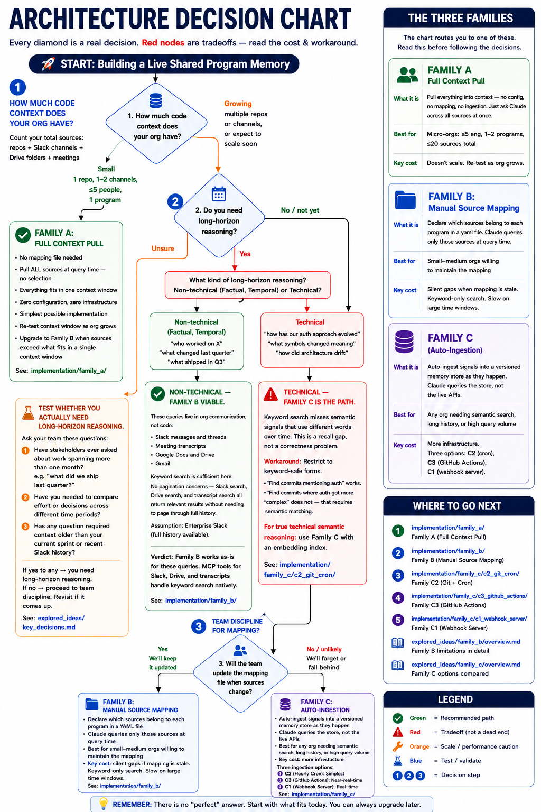

# Build Your Own Serro

> A starter kit for building live shared program memory using Claude Code, MCP integrations, and git - no proprietary infrastructure required.

> **This repo contains step-by-step instructions, not code.** There is nothing to `npm install` or `docker run`. Each family folder is a guide for how to build the implementation yourself using Claude Code and native MCP integrations.

[]()
[]()
[]()

---

## Why Serro published this

We want our customers to succeed - with or without us.

If you have the engineering bandwidth to build and operate your own live program memory, this repo gives you the full architecture: every decision point, every tradeoff, every dead end we found. You'll know exactly what you're signing up for.

If, after reading this, you'd rather not operate it yourself - [Serro](https://serro.ai) is the managed version. Same capabilities, no infrastructure, with a proprietary ontology built from three years of org signals.

Either way, you'll have made an informed choice. That's the goal.

---

## What is live program memory?

An AI-native engineering org runs multiple programs in parallel - each with its own scope, stakeholders, signals, and decisions. Live program memory means every AI agent in your org can answer questions like:

- *"What decisions did the platform team make last quarter and why?"*
- *"Which engineers have been working on auth - and for how long?"*
- *"What action items from last week's design review are still open?"*
- *"Has the scope of Program X drifted from its original charter?"*

Without live program memory, every Claude session starts from zero. Engineers re-explain context. Decisions get repeated. Work happens invisibly.

[Serro](https://serro.ai) solves this by maintaining a continuously updated, program-indexed memory across GitHub, Slack, Google Drive, and meetings - and making it queryable by any agent in the org.

This repo documents how to replicate that using only Claude Code and native MCP integrations.

---

## What you're building

```
┌─────────────────────────────────────────────────────┐
│  Widget layer       Prompt-based live views of       │
│                     program state (requires layer 2) │  ← out of scope
├─────────────────────────────────────────────────────┤
│  Proactive layer    Monitors programs, alerts on     │
│                     drift, follows up on actions     │  ← out of scope
│                     (requires layer 3)               │
├─────────────────────────────────────────────────────┤
│  Memory layer       Signals from GitHub/Slack/Drive  │
│                     organized by program, queryable  │  ← this repo
│                     by any Claude session            │
└─────────────────────────────────────────────────────┘
```

**This repo covers the memory layer only** - shared program memory that is live, queryable, and organized by program. The proactive and widget layers depend on it, but are out of scope here. We may expand scope in a future checkpoint.

---

## Which architecture fits your org?

There are three approaches. Pick based on org size and what kind of reasoning you need.

```
Where to start
      │
      ▼
┌─────────────────────────┐
│  Small org?             │  yes ──▶  Family A
│  ≤5 eng, ≤20 sources    │           just pull everything in
└─────────────────────────┘
      │ no
      ▼
┌─────────────────────────┐
│  Beyond keyword search? │  no  ──▶  Family B
│  semantic · history ·   │           map sources, then query
│  scale                  │
└─────────────────────────┘
      │ yes
      ▼
   Family C
   auto-ingest + search


   or build on top of Serro  ──▶  serro.ai
```

| Family | What it is | Best for |
|---|---|---|
| **Family A** - Full Context Pull | No config. Pull all sources at query time. | ≤5 engineers, 1 repo, 1–2 programs |
| **Family B** - Manual Source Mapping | Declare sources per program in yaml. Claude queries only those. | Small–medium orgs willing to maintain the mapping |
| **Family C** - Auto-Ingestion | Ingest signals into a versioned memory store on a schedule or webhook. Claude queries the store. | Any org needing semantic search, long history, or scale |
| **[Serro](https://serro.ai)** - Managed | Connect your tools. Start connecting your downstream agents through MCP. Nothing to build or operate. | Any org that wants live program memory without the infrastructure |

Full decision tree with all tradeoffs: [`decision_chart.md`](decision_chart.md)



---

## What Serro does that this can't (yet)

This is an honest comparison. The open-source version covers the architecture - but Serro has advantages that aren't replicable with public tooling alone:

| Capability | Open-source (this repo) | Serro |
|---|---|---|
| Live memory ingestion | ✅ Hourly–seconds depending on Family C option | ✅ Continuous, event-driven |
| Program-indexed memory | ✅ Via `programs_to_sources_mapping.yaml` | ✅ Auto-classified, org-wide |
| Keyword search across sources | ✅ Via MCP (GitHub, Slack, Drive) | ✅ |
| Semantic / embedding search | ⚠️ Requires self-hosted vector store (Family C) | ✅ Built-in |
| Temporal code intelligence | ⚠️ Keyword search only - conceptual drift not detectable | ✅ Symbol-level history |
| Engineer contribution history | ⚠️ Reconstructed from git blame + Slack - incomplete | ✅ Continuously maintained |
| Voice-driven memory updates | ❌ | ✅ |
| Proactive program coordination | ⚠️ Schedulable via cron - not event-driven | ✅ |
| Zero-config setup | ❌ Requires mapping yaml + MCP server setup | ✅ |

The biggest structural gap is the data corpus. Serro has been ingesting and indexing org signals since 2023. The open-source version starts from zero. That gap matters most for temporal reasoning and contribution history.

---

## Current status

| Layer | Status | Notes |
|---|---|---|
| Memory layer | 🟢 Instructions written | Three architectures documented with step-by-step guides. Not validated against a real org. |
| Proactive layer | 🔴 Out of scope (checkpoint 1) | Requires memory layer to be validated first |
| Widget layer | 🔴 Out of scope (checkpoint 1) | Requires memory + proactive layers |

**Checkpoint 1 complete:** capability analysis, architectural decision tree, and implementation options documented.  
**Checkpoint 2:** build Family B or C2 against a real org and measure classification accuracy, coverage, and latency.

---

## Quick start

> **Read [`critical_review.md`](critical_review.md) first.** This repo has a conflict of interest - it's written by the people who built Serro. The review names the biases explicitly.

**1. Understand what you're replicating**
```
research/serro_capabilities.md
```
Seven capabilities across three layers, with difficulty ratings and measurement rubrics.

**2. Pick an architecture**
```
decision_chart.md
```
A decision tree with 14 decision points. The wrong architecture choice costs weeks.

**3. Read what didn't work**
```
comparative_analysis.md
```
MCP is pull-only - not a continuous stream. Several architectural assumptions fail because of this. Don't repeat the mistakes.

**4. Follow implementation instructions**
```
family_a/  family_b/  family_c/
```
Pick your family from the decision chart. Each folder has an `instructions.md`.

**5. Copy the templates**
```
templates/
```
`programs_to_sources_mapping.yaml`, `charter.md`, and `CLAUDE_template.md` are ready to fill in.

---

## Repo structure

```
├── README.md                        ← you are here
├── CLAUDE.md                        ← agent navigation (read if you're an AI)
├── goal.md                          ← mission and motivation
├── critical_review.md               ← honest critique of this analysis
├── comparative_analysis.md          ← what we tried, what broke, the key fork
├── key_decisions.md                 ← 14 decision points with rationale
├── decision_chart.md                ← mermaid decision tree for picking an approach
│
├── research/
│   └── serro_capabilities.md        ← 7 capabilities, difficulty ratings, open questions
│
├── family_a/
│   └── instructions.md              ← full context pull - micro-orgs, zero config
│
├── family_b/
│   ├── overview.md                  ← human-maintained source mapping approach
│   └── instructions.md             ← step-by-step setup
│
├── family_c/
│   ├── overview.md                  ← auto-ingestion: C1 / C2 / C3 comparison
│   ├── c1_webhook_server.md         ← always-on server (seconds latency)
│   ├── c2_git_cron.md               ← git + scheduled cron (hourly, recommended start)
│   ├── c3_github_actions.md         ← GitHub Actions + Cloudflare Worker (1–2 min)
│   └── instructions.md             ← step-by-step setup
│
├── templates/
│   ├── programs_to_sources_mapping.yaml
│   ├── charter.md
│   └── CLAUDE_template.md
│
└── content/
    ├── youtube_script_checkpoint_1.md
    └── blog_post_checkpoint_1.md
```

---

## Read this before building

- [`critical_review.md`](critical_review.md) - conflict of interest, unvalidated assumptions, what would constitute real evidence
- [`comparative_analysis.md`](comparative_analysis.md) - Approach 1 failed because MCP is pull-only. Don't design around polling as if it's continuous ingestion.
- [`family_b/overview.md`](family_b/overview.md) - Family B has 6 known limitations. Long-horizon technical reasoning is the hardest gap to close.

---

## Concepts

- [What is a program?](#what-is-a-program)
- [What is program engineering?](#what-is-program-engineering)
- [What is an agentic TPM?](#what-is-an-agentic-tpm)
- [What is live program memory?](#what-is-live-program-memory-1)
- [Why not just use Jira, Linear, or Notion?](#why-not-just-use-jira-linear-or-notion)
- [What is MCP and why does it matter here?](#what-is-mcp-and-why-does-it-matter-here)

---

### What is a program?

A program is a named, ongoing technical initiative with a defined scope, a set of owning engineers, and signals distributed across multiple tools. Unlike a ticket (which tracks one task) or a project (which has a hard end date), a program is continuous. It has a charter, stakeholders, and a living record of decisions, commitments, and scope changes.

Examples: "Platform Reliability", "Auth Modernization", "AI Discoverability", "Mobile Launch Q3".

---

### What is program engineering?

Program engineering is what happens when multiple workstreams all point at the same outcome and none of them, fixed in isolation, achieves it. A program gives that work a name, an owner, a sequence, and honest visibility into whether it's on track. Unlike a project, it doesn't end — it recurs. And every time it runs without a shared memory of how it ran before, the coordination cost compounds from scratch.

Program engineering used to be a large-company problem. You hit it somewhere around 80 engineers when the org got complex enough that coordination started breaking down. Before that, a good senior engineer or EM could hold the picture in their head.

That threshold is gone.

AI has decoupled team size from execution capacity. A 10-person engineering team today can move at a speed and breadth that would have required 80 people five years ago. The ambition expands to meet the new capacity. And the moment you're running eight things at once with a team of ten, you have an 80-person company's coordination problems with none of the organizational infrastructure that large companies built to handle them.

This is the shift from product engineering to program engineering. When a program has no name, no owner, and no shared visibility, it still gets run — by whoever has enough context to hold the picture. That person becomes the accidental program engineer, doing it on top of their actual job, and all the institutional knowledge lives in their head.

[Read the full essay - Welcome to Program Engineering](https://serro.ai/blog/welcome-to-program-engineering)

---

### What is an agentic TPM?

An agentic TPM platform is infrastructure for program engineering - not a replacement for the TPM role. With live program intelligence, agentic actions, and self-driven reports, it surfaces program visibility for everyone driving the work so they spend less time coordinating and more time executing. It scales TPM capacity without scaling headcount.

It does this by:

- Continuously ingesting signals from GitHub, Slack, Drive, and meetings
- Maintaining a live model of each program's state: who's working on what, what decisions were made, what commitments are outstanding
- Surfacing blockers before they're escalated
- Following up on action items
- Routing context to downstream agents so they don't start from zero

[Serro](https://serro.ai) is an agentic TPM. This repo is a guide for building a version of it yourself.

---

### What is live program memory?

Live program memory is an always-current, program-indexed record of everything that matters to a program: decisions, contributors, scope changes, blockers, and action items.

"Live" means it updates automatically as signals arrive - not a static doc someone has to remember to update.

"Program-indexed" means signals are organized by program, not by tool or date. A question like "what changed about the auth program last quarter?" draws from GitHub, Slack, Drive, and meeting transcripts simultaneously.

This is the problem this repo is trying to solve.

---

### Why not just use Jira, Linear, or Notion?

Those tools track work at the ticket or document level. They don't maintain a cross-source model of program state over time. Connecting signals - a GitHub PR to a Jira ticket to a Slack decision to a meeting transcript - is still manual.

An agentic TPM does that connection automatically and makes the result queryable.

Jira answers: *"what's the status of this ticket?"*
An agentic TPM answers: *"what has changed about the auth program over the last quarter, and why?"*

---

### What is MCP and why does it matter here?

MCP (Model Context Protocol) is an open protocol that lets Claude connect to external tools - GitHub, Slack, Google Drive, meetings - and query them in real time. Instead of copy-pasting context into a chat window, Claude reads from live sources directly.

This repo uses MCP integrations as the data layer for all three implementation families.

The key constraint: **MCP is pull-only.** Claude reads from tools when asked; it does not receive a continuous stream of events. That single constraint shapes every architectural decision in this repo - it's why Family C (auto-ingestion) exists at all.

---

## Contributing

This is an open experiment. Contributions that advance it are welcome:

- **Measurements** - ran Family B or C2 against a real org? Classification accuracy, coverage, and latency numbers are the most valuable thing you can add.
- **Dead ends** - tried something that didn't work? Document it in `comparative_analysis.md`.
- **Implementation gaps** - `family_a/instructions.md`, `family_b/instructions.md`, and `family_c/instructions.md` need step-by-step instructions written.
- **Alternative architectures** - `family_c/overview.md` has a placeholder for approaches not yet identified.

Please do not contribute claims without measurements. The value of this repo is honest engineering, not optimistic design.

---

## License

MIT. Use it, fork it, build on it.

---

## Related

- [Serro](https://serro.ai) - the managed version of what this repo attempts to build
- [Claude Code](https://claude.ai/code) - the tool this is built with
- [Model Context Protocol](https://modelcontextprotocol.io) - the integration layer all approaches depend on

### Worth knowing if you're going deep on Family C

- [Apache Iggy](https://github.com/iggy-rs/iggy) - persistent message streaming platform (lightweight Kafka in Rust). Fits as a durable event bus between your webhook sources and ingestion agent — gives you replay, backpressure, and delivery guarantees that raw webhooks don't.
- [CocoIndex](https://github.com/cocoindex-io/cocoindex) - open-source incremental data transformation framework built for AI indexing pipelines. Fits as a replacement for the custom ingestion agent — handles source-to-index transformation, incremental updates, and embedding generation declaratively.
