```mermaid
flowchart TD
    START([🚀 Start: Building a Live Shared Program Memory]) --> Q_CONTEXT_SIZE

    %% ─── CONTEXT SIZE (Decision 1) ──────────────────────────────────
    Q_CONTEXT_SIZE{"1. How much context does your org have?\nCount your total sources:\nrepos + Slack channels + Drive folders + meetings"}

    Q_CONTEXT_SIZE -- "Small\n1 repo, 1–2 channels,\n≤5 people, 1 program" --> FAMILYA
    Q_CONTEXT_SIZE -- "Growing\nmultiple repos or channels,\nor expect to scale soon" --> Q_HORIZON

    FAMILYA(["✅ Family A: Full Context Pull\n• No mapping file needed\n• Pull ALL sources at query time - no selection\n• Everything fits in one context window\n• Zero configuration, zero infrastructure\n• Simplest possible implementation\n• Re-test context window as org grows\n• Upgrade to Family B when sources exceed\n  what fits in a single context window\nSee: family_a/"])

    %% ─── LONG HORIZON (Decision 2) ──────────────────────────────────
    Q_HORIZON{"2. Do you need long-horizon reasoning?\ne.g. 'how has scope drifted over 3 months',\n'Q3 vs Q4 effort comparison',\n'what decisions changed direction'"}

    Q_HORIZON -- "No / not yet" --> Q_DISCIPLINE
    Q_HORIZON -- "Yes" --> HORIZON_TYPE
    Q_HORIZON -- "Unsure" --> HORIZON_TEST

    HORIZON_TEST["🧪 Test whether you actually need long-horizon reasoning.\nAsk your team these questions:\n1. Have stakeholders ever asked about work\n   spanning more than one month?\n   e.g. 'what did we ship last quarter?'\n2. Have you needed to compare effort or decisions\n   across different time periods?\n3. Has any question required context older than\n   your current sprint or recent Slack history?\nIf yes to any → you need long-horizon reasoning.\nIf no → proceed to org size. Revisit if it comes up.\nSee: key_decisions.md"]
    HORIZON_TEST --> Q_DISCIPLINE

    HORIZON_TYPE{"What kind of long-horizon reasoning?\nNon-technical (Factual, Temporal) or Technical?"}

    HORIZON_TYPE -- "Non-technical\nFactual, Temporal\n'who worked on X'\n'what changed last quarter'\n'what shipped in Q3'" --> HORIZON_FACTUAL
    HORIZON_TYPE -- "Technical\n'how has our auth approach evolved'\n'what symbols changed meaning'\n'how did architecture drift'" --> HORIZON_SEMANTIC

    HORIZON_FACTUAL["✅ Non-technical, Factual, Temporal - Family B viable.\n\nThese queries live in org communication, not code:\n• Slack messages and threads\n• Meeting transcripts\n• Google Docs and Drive\n• Gmail\n\nKeyword search is sufficient here.\n'What was decided in Q3?' → search Slack + Drive.\n'Who owns this initiative?' → search transcripts + Docs.\n'What did we agree on in that meeting?' → transcript search.\n\nNo pagination concerns - Slack search, Drive search,\nand transcript search all return relevant results\nwithout needing to page through full history.\n\nAssumption: Enterprise Slack (full history available).\n\nVerdict: Family B works as-is for these queries.\nMCP tools for Slack, Drive, and transcripts\nhandle keyword search natively.\nSee: family_b/"]
    HORIZON_FACTUAL --> Q_DISCIPLINE

    HORIZON_SEMANTIC["⚠️ Technical long-horizon reasoning is harder.\n\nWhat this means:\nQuestions about how concepts, architecture, or\napproach evolved over time - not just what changed,\nbut what it means. e.g. 'Has our approach to\nauthentication drifted from the original design?'\nor 'Which symbols accumulated the most\nunplanned responsibility over 6 months?'\n\nWhy keyword search falls short:\nGitHub MCP matches text in commit messages\nand diffs. Conceptual evolution often uses\ndifferent words at different times - the signal\nexists but keyword search won't surface it.\nThis is a recall gap, not a correctness problem.\n\nWorkaround: Restrict to keyword-safe forms.\n'Find commits mentioning auth' works.\n'Find commits where auth got more complex'\ndoes not - that requires semantic matching.\nSee: family_c/c2_git_cron/"]
    HORIZON_SEMANTIC --> FAMILYC_ENTRY

    %% ─── TEAM DISCIPLINE ─────────────────────────────────────────────
    Q_DISCIPLINE{"3. Team discipline for\nmapping maintenance?\nWill the team update\nprogram_mappings.yaml\nwhen channels/repos change?"}

    Q_DISCIPLINE -- "Yes, owned explicitly" --> Q_SILENT_GAPS
    Q_DISCIPLINE -- "No / unreliable" --> Q_AUTO_MAPPING

    %% ─── MAPPING AUTOMATION ──────────────────────────────────────────
    Q_AUTO_MAPPING{"How do you want mapping\nmaintained automatically?"}

    Q_AUTO_MAPPING -- "Self-hosted loop (C-4)\nRuns today on any machine\nwith Claude Code" --> FAMILYC_ENTRY
    Q_AUTO_MAPPING -- "Cloud-managed loops\n(Anthropic cloud workflows,\ncoming soon)" --> CLOUD_WORKFLOWS_TRADEOFF
    Q_AUTO_MAPPING -- "Fully managed\n(no infra, proprietary data corpus)" --> SERRO

    CLOUD_WORKFLOWS_TRADEOFF["⚠️ Cloud workflows: not yet shipped.\n\nAnthropic is building cloud-native loop support for Claude Code.\nWhen it ships: same /loop prompt, runs in Anthropic's cloud,\nalways-on, no machine required, full MCP connectivity.\n\nTradeoff vs. self-hosted C-4:\n• Cloud: no infra, always-on, Anthropic-managed\n• Self-hosted: runs today, you manage the process\n\nTradeoff vs. Serro:\n• Cloud workflows: open-source prompts, no proprietary data\n• Serro: proprietary ontology + 3 years of org signal corpus\n\nWorkaround: Run C-4 on a cheap VPS ($5/mo) or spare\nmachine today. Migrate when cloud workflows ship —\nno prompt changes needed.\nSee: family_c/c4_loop.md"]
    CLOUD_WORKFLOWS_TRADEOFF --> FAMILYC_ENTRY

    %% ─── SILENT GAPS ─────────────────────────────────────────────────
    Q_SILENT_GAPS{"4. Accept silent gaps?\nWork in unmapped sources\nis excluded with no warning"}

    Q_SILENT_GAPS -- "Yes, explicitly accepted\nand team understands this" --> Q_RATE_LIMITS
    Q_SILENT_GAPS -- "No, need full coverage" --> SILENT_TRADEOFF

    SILENT_TRADEOFF["⚠️ Tradeoff: Partial Family B vs. Family C\n\nSilent gaps are the cost of Family B's simplicity.\nThey can be reduced but not eliminated without\nmoving to auto-ingestion.\n\nWorkaround A: Mapping health check (see DISCIPLINE_TRADEOFF)\nreduces gaps caused by stale config.\nWorkaround B: Quarterly mapping review ritual -\nprogram owners audit their source list each quarter.\nWorkaround C: Add a 'catch-all' channel per program\nwhere anything relevant gets manually cross-posted.\n\nVerdict: If zero-gap coverage is a requirement,\nFamily C is the only honest path. If partial coverage\nwith explicit acknowledgment is acceptable,\nFamily B with health checks can work.\nSee: family_b/\n     family_c/"]
    SILENT_TRADEOFF --> Q_RATE_LIMITS

    %% ─── RATE LIMITS ─────────────────────────────────────────────────
    Q_RATE_LIMITS{"5. Query frequency?\nFamily B pays API cost\nper query, not per event"}

    Q_RATE_LIMITS -- "Low\na few times per day" --> FAMILYB_CTX_TEST
    Q_RATE_LIMITS -- "High\nmany users or automated agents" --> RATE_TRADEOFF

    RATE_TRADEOFF["⚠️ Tradeoff: Per-query API cost\n\nFamily B fires multiple MCP calls on every query.\nHigh frequency = high API call volume = rate limit risk.\n\nWorkaround A: Cache query results in memory.md\nwith a TTL (e.g. 15 min) - re-use cached answer\nif memory hasn't updated since last query.\nWorkaround B: Rate-limit Claude queries per user/session.\nWorkaround C: Move to Family C - pay API cost\nonce per event at ingestion, free at query time.\n\nVerdict: For ≤10 queries/hour across the org,\nrate limits are unlikely to be a real problem.\nAbove that, measure actual API usage before\nassuming limits will be hit.\nSee: family_c/"]
    RATE_TRADEOFF --> FAMILYB_CTX_TEST

    %% ─── CONTEXT WINDOW TEST ─────────────────────────────────────────
    FAMILYB_CTX_TEST["🧪 6. Context window gate - run this test.\nFire one real cross-source query:\n• All declared sources for one program\n• Measure: total tokens returned\n• Check: fits in context without truncation?\n• Measure: end-to-end latency\n• Evaluate: answer quality vs. human ground truth\nDo not commit to Family B without this data."]
    FAMILYB_CTX_TEST --> Q_CTX_PASS

    Q_CTX_PASS{"Context window test result?"}

    Q_CTX_PASS -- "✅ Passed:\nfits, fast, accurate" --> FAMILYB
    Q_CTX_PASS -- "❌ Failed:\ntoo large / slow / degraded" --> CTX_FAIL_TRADEOFF

    CTX_FAIL_TRADEOFF["⚠️ Tradeoff: Scoped queries vs. ingestion\n\nContext window failure doesn't mean abandon Family B -\nit means Family B needs scoping constraints.\n\nWorkaround A: Limit queries to one program at a time\n(no cross-program queries in Family B).\nWorkaround B: Limit time window ('last 7 days only').\nWorkaround C: Pre-summarize each source's recent\nactivity into a program digest - one MCP call\nbecomes one short summary.\nWorkaround D: Move to Family C (C2 recommended).\n\nVerdict: If scoping workarounds produce acceptable\nanswer quality, Family B is still viable with constraints.\nIf not, C2 is the lowest-complexity upgrade.\nSee: family_b/\n     family_c/c2_git_cron/"]
    CTX_FAIL_TRADEOFF --> FAMILYB

    %% ─── FAMILY A ────────────────────────────────────────────────────
    FAMILYB(["✅ Family B: Manual Source Mapping\n• Zero infrastructure beyond MCP servers\n• Always-live data - no staleness\n• Cross-source joins via targeted MCP calls\n• Accepted constraints documented above\n• Re-run context test as org grows\nSee: family_b/instructions.md"])
    FAMILYB --> DONE
    FAMILYA --> DONE

    %% ─── FAMILY C CAPABILITY SELECTION ──────────────────────────────
    FAMILYC_ENTRY{"7. Family C: what capabilities\ndo you need?\n(or use Serro for fully managed)"}

    FAMILYC_ENTRY --> Q_SEMANTIC

    Q_SEMANTIC{"Need semantic search?\n'How has auth evolved?'\n'Which decisions reversed direction?'"}

    Q_SEMANTIC -- "No" --> Q_ENTITY_RES
    Q_SEMANTIC -- "Yes" --> SEMANTIC_OPTIONS

    SEMANTIC_OPTIONS["Semantic search:\n\n🔧 Self-hosted:\nVector DB (Chroma, pgvector, Pinecone) stores embeddings.\nCocoIndex or LaserData transforms digest output into\nindexed vectors. Enables similarity search over\nstructured digest content.\n\nSetup: run C-4 loop first, add CocoIndex after\ndigests are stable.\n\n🔵 Serro:\nBuilt-in embedding index over all ingested signals.\nNo setup, always current.\nSee: cocoindex.io · laserdata.ai · serro.ai"]
    SEMANTIC_OPTIONS --> Q_ENTITY_RES

    Q_ENTITY_RES{"Need entity resolution?\n'Who is @jkim across Slack,\ngit commits, and Drive docs?'"}

    Q_ENTITY_RES -- "No" --> Q_TEMPORAL
    Q_ENTITY_RES -- "Yes" --> ENTITY_OPTIONS

    ENTITY_OPTIONS["Entity resolution:\n\n🔧 Self-hosted:\nGraph DB (Amazon Neptune, FalkorDB) stores entities\nand relationships. CocoIndex or LaserData transforms\ndigests into typed graph nodes (person, repo, decision).\nWorkaround: declare all identities explicitly in\nprogram_mappings.yaml (slack_ids, GitHub handles) —\ncovers ~80% of attribution without graph infra.\n\n🔵 Serro:\nProprietary ontology links people, repos, and decisions\nautomatically across all tools from day one.\nSee: cocoindex.io · laserdata.ai · serro.ai"]
    ENTITY_OPTIONS --> Q_TEMPORAL

    Q_TEMPORAL{"Need temporal accuracy?\n'What was auth's state in March?'\n'When did scope drift begin?'"}

    Q_TEMPORAL -- "No" --> Q_INGESTION
    Q_TEMPORAL -- "Yes" --> TEMPORAL_OPTIONS

    TEMPORAL_OPTIONS["Temporal accuracy:\n\n🔧 Self-hosted:\nFalkorDB supports temporal graph snapshots —\nquery the graph as it existed at any point in time.\nAlternative: append-only digest files in git give a\ncoarse timeline for free (one snapshot per run).\nCocoIndex handles incremental re-indexing so only\nchanged signals are re-processed.\n\n🔵 Serro:\nContinuous event-driven ingestion with timestamps\non every signal — full temporal query support.\nSee: github.com/FalkorDB · cocoindex.io · serro.ai"]
    TEMPORAL_OPTIONS --> Q_INGESTION

    Q_INGESTION{"8. Which ingestion method?\n\n⭐ C-4 is the recommended starting point.\nOnly choose another option if you have\na specific operational requirement."}

    Q_INGESTION -- "✅ C-4 — recommended\nOne /loop command, no infra" --> C4
    Q_INGESTION -- "C-2 — need headless\n(no active session)" --> C2
    Q_INGESTION -- "C-3 — need <2 min latency\n(GitHub Actions + Worker)" --> Q_C3_INFRA
    Q_INGESTION -- "C-1 — need seconds latency\n(always-on server)" --> Q_C1_INFRA

    Q_C3_INFRA{"9. Can you write and deploy\na ~10-line Cloudflare Worker?\n(free tier, stateless, no uptime mgmt)"}
    Q_C3_INFRA -- Yes --> C3
    Q_C3_INFRA -- "No / prefer simpler" --> B3_TRADEOFF

    B3_TRADEOFF["⚠️ Tradeoff: C2 with shorter cron interval\n\nIf Cloudflare Worker is too much,\nC2 with a 15-minute cron interval achieves\n~15 min latency with zero new code.\nNot as good as C3 but meaningfully better\nthan hourly polling.\n\nWorkaround: Set cron to */15 instead of @hourly.\nVerdict: Acceptable if 15-min lag is tolerable.\nSee: family_c/c2_git_cron.md"]
    B3_TRADEOFF --> C2

    Q_C1_INFRA{"9. Willing to operate\nan always-on server?\n(uptime, monitoring, webhook\nsig validation, Drive channel\nrenewal every 24h)"}
    Q_C1_INFRA -- Yes --> C1
    Q_C1_INFRA -- "No" --> B1_TRADEOFF

    B1_TRADEOFF["⚠️ Tradeoff: C3 is near-real-time without a server\n\nC3 achieves 1–2 min latency.\nFor most program management use cases,\n1–2 min vs. seconds is an acceptable gap.\nOnly genuine real-time use cases (live incident\nresponse, immediate meeting capture) need C1.\n\nVerdict: Use C3. Revisit C1 only if 1–2 min\nlag creates a real operational problem.\nSee: family_c/c3_github_actions.md"]
    B1_TRADEOFF --> C3

    C4(["✅ Option C-4: Claude Code Loop — recommended Family C start\n• Claude IS the scheduler — self-pacing based on activity\n• One /loop command, no cron, no bash scripts\n• Persistent context across iterations\n• Requires a running Claude Code process\n• Natural upgrade path to Anthropic cloud workflows\n\nNeed a different approach? See family_c/ for:\n• C-2: headless cron · C-3: GitHub Actions · C-1: webhook server\nSee: family_c/c4_loop.md"])

    C2(["✅ Option C-2: Shared Git Repo + Scheduled Cron\n• Hourly polling via MCP\n• Zero new infrastructure — fully headless\n• Git = versioned memory history for free\n• Predictable run times, auditable\n• Upgrade to C3 if lag matters\nSee: family_c/c2_git_cron/"])

    C3(["✅ C3: GitHub Actions + Cloudflare Worker\n• 1–2 min latency on GitHub events\n• ~10-line Worker forwards Slack/Drive events\n• GitHub Actions runner = free tier compute\n• Cron fallback catches missed events\nSee: family_c/c3_github_actions/"])

    C1(["✅ C1: Webhook Server\n• Seconds latency\n• You operate a server 24/7\n• Highest fidelity to production TPM arch\n• Drive push channels expire every 24h\nSee: family_c/c1_webhook_server/"])

    SERRO(["🔵 Serro — fully managed program memory\n• No infrastructure to operate\n• Proprietary ontology + 3 years of org signal data\n• Entity resolution: people, repos, decisions linked\n  automatically across all tools\n• Always-on event-driven ingestion, zero config\n• Same capabilities as this repo — with the data corpus\nSee: serro.ai"])

    DONE(["📋 Implementation chosen.\nSee: README.md for next steps.\nSee: verdict.md for full rationale.\nFor other Family C options: family_c/"])

    C4 --> DONE
    C2 --> DONE
    C3 --> DONE
    C1 --> DONE

    %% ─── STYLES ──────────────────────────────────────────────────────
    style FAMILYB fill:#d4edda,stroke:#28a745,color:#000
    style FAMILYA fill:#d4edda,stroke:#28a745,color:#000
    style C1 fill:#d4edda,stroke:#28a745,color:#000
    style C4 fill:#d4edda,stroke:#28a745,color:#000
    style C2 fill:#d4edda,stroke:#28a745,color:#000
    style C3 fill:#d4edda,stroke:#28a745,color:#000
    style DONE fill:#d4edda,stroke:#28a745,color:#000
    style FAMILYB_CTX_TEST fill:#fff3cd,stroke:#ffc107,color:#000
    style HORIZON_TEST fill:#fff3cd,stroke:#ffc107,color:#000
    style SERRO fill:#dbeafe,stroke:#3b82f6,color:#000
    style SEMANTIC_OPTIONS fill:#fff3cd,stroke:#ffc107,color:#000
    style ENTITY_OPTIONS fill:#fff3cd,stroke:#ffc107,color:#000
    style TEMPORAL_OPTIONS fill:#fff3cd,stroke:#ffc107,color:#000
```

# Architecture Decision Chart

> Every diamond is a real decision. Red nodes are not dead ends - they are tradeoffs with a workaround and a cost. Read the verdict before moving on.

---

## The three families

The chart routes you to one of these. Read this before following the decisions.

| Family | What it is | Best for | Key cost |
|---|---|---|---|
| **Family A** | Pull everything into context - no config, no mapping, no ingestion. Just ask Claude across all sources at once. | Micro-orgs: ≤5 eng, 1–2 programs, ≤20 sources total | Doesn't scale. Re-test as org grows. |
| **Family B: Manual Source Mapping** | Declare which sources belong to each program in a yaml file. Claude queries only those sources at query time. | Small–medium orgs willing to maintain the mapping | Silent gaps when mapping is stale. Keyword-only search. Slow on large time windows. |
| **Family C** | Auto-ingest signals into a versioned memory store as they happen. Claude queries the store, not the live APIs. | Any org needing semantic search, long history, or high query volume | Requires a persistent process or scheduler. Four options: C-4 (Claude loop, recommended start), C-2 (hourly cron), C-3 (GitHub Actions), C-1 (webhook server). |

**The decision tree below tells you which one fits your org.** If you already know your answer, skip to:
- [`family_a/instructions.md`](family_a/instructions.md) - full context pull (micro-orgs)
- [`family_b/instructions.md`](family_b/instructions.md) - source mapping setup
- [`family_c/c4_loop.md`](family_c/c4_loop.md) - Claude loop, recommended Family C start
- [`family_c/c2_git_cron.md`](family_c/c2_git_cron.md) - headless cron option
- [`family_c/c3_github_actions.md`](family_c/c3_github_actions.md) - near-real-time ingestion
- [`family_b/overview.md`](family_b/overview.md) - Family B limitations in detail
- [`family_c/overview.md`](family_c/overview.md) - Family C options compared

---

---

## How to read this chart

- **Green nodes** - a viable implementation choice with a path to `family_a/`, `family_b/`, or `family_c/`
- **Blue nodes** - a managed/hosted alternative (Serro)
- **Yellow nodes** - a test or measurement required before proceeding
- **Orange nodes (⚠️)** - a tradeoff: shows workarounds, costs, and a verdict. Not a dead end.
- **Diamonds** - a decision point. Read the notes in [`key_decisions.md`](key_decisions.md) for full rationale on each.

Every path leads somewhere buildable. The question is which tradeoffs you're willing to accept.
