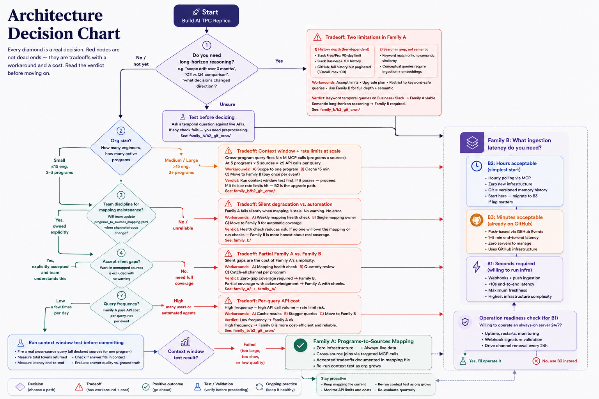

# Architecture Decision Chart

> Every diamond is a real decision. Red nodes are not dead ends - they are tradeoffs with a workaround and a cost. Read the verdict before moving on.

---

## The three families

The chart routes you to one of these. Read this before following the decisions.

| Family | What it is | Best for | Key cost |
|---|---|---|---|
| **Family A** | Pull everything into context - no config, no mapping, no ingestion. Just ask Claude across all sources at once. | Micro-orgs: ≤5 eng, 1–2 programs, ≤20 sources total | Doesn't scale. Re-test as org grows. |
| **Family B: Manual Source Mapping** | Declare which sources belong to each program in a yaml file. Claude queries only those sources at query time. | Small–medium orgs willing to maintain the mapping | Silent gaps when mapping is stale. Keyword-only search. Slow on large time windows. |
| **Family C** | Auto-ingest signals into a versioned memory store as they happen. Claude queries the store, not the live APIs. | Any org needing semantic search, long history, or high query volume | More infrastructure. Three options: C2 (hourly cron), C3 (GitHub Actions), C1 (webhook server). |

**The decision tree below tells you which one fits your org.** If you already know your answer, skip to:
- [`family_a/instructions.md`](family_a/instructions.md) - full context pull (micro-orgs)
- [`family_b/instructions.md`](family_b/instructions.md) - source mapping setup
- [`family_c/c2_git_cron.md`](family_c/c2_git_cron.md) - simplest auto-ingestion
- [`family_c/c3_github_actions.md`](family_c/c3_github_actions.md) - near-real-time ingestion
- [`family_b/overview.md`](family_b/overview.md) - Family B limitations in detail
- [`family_c/overview.md`](family_c/overview.md) - Family C options compared

---



> The Mermaid source below is the canonical version (includes Family A added after this image was exported). The image above is checkpoint 1.

```mermaid
flowchart TD
    START([🚀 Start: Building a Live Shared Program Memory]) --> Q_CONTEXT_SIZE

    %% ─── CONTEXT SIZE (Decision 1) ──────────────────────────────────
    Q_CONTEXT_SIZE{"1. How much code context does your org have?\nCount your total sources:\nrepos + Slack channels + Drive folders + meetings"}

    Q_CONTEXT_SIZE -- "Small\n1 repo, 1–2 channels,\n≤5 people, 1 program" --> FAMILYA
    Q_CONTEXT_SIZE -- "Growing\nmultiple repos or channels,\nor expect to scale soon" --> Q_HORIZON

    FAMILYA(["✅ Family A: Full Context Pull\n• No mapping file needed\n• Pull ALL sources at query time - no selection\n• Everything fits in one context window\n• Zero configuration, zero infrastructure\n• Simplest possible implementation\n• Re-test context window as org grows\n• Upgrade to Family B when sources exceed\n  what fits in a single context window\nSee: family_a/"])

    %% ─── LONG HORIZON (Decision 2) ──────────────────────────────────
    Q_HORIZON{"2. Do you need long-horizon reasoning?\ne.g. 'how has scope drifted over 3 months',\n'Q3 vs Q4 effort comparison',\n'what decisions changed direction'"}

    Q_HORIZON -- "No / not yet" --> Q_DISCIPLINE
    Q_HORIZON -- "Yes" --> HORIZON_TYPE
    Q_HORIZON -- "Unsure" --> HORIZON_TEST

    HORIZON_TEST["🧪 Test whether you actually need long-horizon reasoning.\nAsk your team these questions:\n1. Have stakeholders ever asked about work\n   spanning more than one month?\n   e.g. 'what did we ship last quarter?'\n2. Have you needed to compare effort or decisions\n   across different time periods?\n3. Has any question required context older than\n   your current sprint or recent Slack history?\nIf yes to any → you need long-horizon reasoning.\nIf no → proceed to org size. Revisit if it comes up.\nSee: key_decisions.md"]
    HORIZON_TEST --> Q_DISCIPLINE

    HORIZON_TYPE{"What kind of long-horizon reasoning?\nNon-technical (Factual, Temporal) or Technical?"}

    HORIZON_TYPE -- "Non-technical\nFactual, Temporal\n'who worked on X'\n'what changed last quarter'\n'what shipped in Q3'" --> HORIZON_FACTUAL
    HORIZON_TYPE -- "Technical\n'how has our auth approach evolved'\n'what symbols changed meaning'\n'how did architecture drift'" --> HORIZON_SEMANTIC

    HORIZON_FACTUAL["✅ Non-technical, Factual, Temporal - Family B viable.\n\nThese queries live in org communication, not code:\n• Slack messages and threads\n• Meeting transcripts\n• Google Docs and Drive\n• Gmail\n\nKeyword search is sufficient here.\n'What was decided in Q3?' → search Slack + Drive.\n'Who owns this initiative?' → search transcripts + Docs.\n'What did we agree on in that meeting?' → transcript search.\n\nNo pagination concerns - Slack search, Drive search,\nand transcript search all return relevant results\nwithout needing to page through full history.\n\nAssumption: Enterprise Slack (full history available).\n\nVerdict: Family B works as-is for these queries.\nMCP tools for Slack, Drive, and transcripts\nhandle keyword search natively.\nSee: family_b/"]
    HORIZON_FACTUAL --> Q_DISCIPLINE

    HORIZON_SEMANTIC["⚠️ Technical long-horizon reasoning is harder.\n\nWhat this means:\nQuestions about how concepts, architecture, or\napproach evolved over time - not just what changed,\nbut what it means. e.g. 'Has our approach to\nauthentication drifted from the original design?'\nor 'Which symbols accumulated the most\nunplanned responsibility over 6 months?'\n\nWhy keyword search falls short:\nGitHub MCP matches text in commit messages\nand diffs. Conceptual evolution often uses\ndifferent words at different times - the signal\nexists but keyword search won't surface it.\nThis is a recall gap, not a correctness problem.\n\nWorkaround: Restrict to keyword-safe forms.\n'Find commits mentioning auth' works.\n'Find commits where auth got more complex'\ndoes not - that requires semantic matching.\n\nFor true technical semantic reasoning:\nFamily C with an embedding index is the\nonly reliable path.\nSee: family_c/c2_git_cron/"]
    HORIZON_SEMANTIC --> FAMILYC_ENTRY

    %% ─── TEAM DISCIPLINE ─────────────────────────────────────────────
    Q_DISCIPLINE{"4. Team discipline for\nmapping maintenance?\nWill the team update\nprograms_to_sources_mapping.yaml\nwhen channels/repos change?"}

    Q_DISCIPLINE -- "Yes, owned explicitly" --> Q_SILENT_GAPS
    Q_DISCIPLINE -- "No / unreliable" --> DISCIPLINE_TRADEOFF

    DISCIPLINE_TRADEOFF["⚠️ Tradeoff: Silent degradation vs. automation\n\nFamily B fails silently when the mapping is stale.\nNo warning. No error. Incomplete answers look complete.\n\nWorkaround A: Add a weekly mapping health check -\na script that verifies all declared channels/repos\nstill exist and alerts if any are missing.\nSee: family_b/\nWorkaround B: Assign a single mapping owner\n(not a team - one person, one responsibility).\nWorkaround C: Move to Family C for automatic coverage.\n\nVerdict: Workaround A reduces risk significantly.\nIf no one will own the mapping or run health checks,\nFamily C is more honest about the real coverage.\nSee: family_c/"]
    DISCIPLINE_TRADEOFF --> Q_SILENT_GAPS

    %% ─── SILENT GAPS ─────────────────────────────────────────────────
    Q_SILENT_GAPS{"5. Accept silent gaps?\nWork in unmapped sources\nis excluded with no warning"}

    Q_SILENT_GAPS -- "Yes, explicitly accepted\nand team understands this" --> Q_RATE_LIMITS
    Q_SILENT_GAPS -- "No, need full coverage" --> SILENT_TRADEOFF

    SILENT_TRADEOFF["⚠️ Tradeoff: Partial Family B vs. Family C\n\nSilent gaps are the cost of Family B's simplicity.\nThey can be reduced but not eliminated without\nmoving to auto-ingestion.\n\nWorkaround A: Mapping health check (see DISCIPLINE_TRADEOFF)\nreduces gaps caused by stale config.\nWorkaround B: Quarterly mapping review ritual -\nprogram owners audit their source list each quarter.\nWorkaround C: Add a 'catch-all' channel per program\nwhere anything relevant gets manually cross-posted.\n\nVerdict: If zero-gap coverage is a requirement,\nFamily C is the only honest path. If partial coverage\nwith explicit acknowledgment is acceptable,\nFamily B with health checks can work.\nSee: family_b/\n     family_c/"]
    SILENT_TRADEOFF --> Q_RATE_LIMITS

    %% ─── RATE LIMITS ─────────────────────────────────────────────────
    Q_RATE_LIMITS{"6. Query frequency?\nFamily B pays API cost\nper query, not per event"}

    Q_RATE_LIMITS -- "Low\na few times per day" --> FAMILYB_CTX_TEST
    Q_RATE_LIMITS -- "High\nmany users or automated agents" --> RATE_TRADEOFF

    RATE_TRADEOFF["⚠️ Tradeoff: Per-query API cost\n\nFamily B fires multiple MCP calls on every query.\nHigh frequency = high API call volume = rate limit risk.\n\nWorkaround A: Cache query results in memory.md\nwith a TTL (e.g. 15 min) - re-use cached answer\nif memory hasn't updated since last query.\nWorkaround B: Rate-limit Claude queries per user/session.\nWorkaround C: Move to Family C - pay API cost\nonce per event at ingestion, free at query time.\n\nVerdict: For ≤10 queries/hour across the org,\nrate limits are unlikely to be a real problem.\nAbove that, measure actual API usage before\nassuming limits will be hit.\nSee: family_c/"]
    RATE_TRADEOFF --> FAMILYB_CTX_TEST

    %% ─── CONTEXT WINDOW TEST ─────────────────────────────────────────
    FAMILYB_CTX_TEST["🧪 7. Context window gate - run this test.\nFire one real cross-source query:\n• All declared sources for one program\n• Measure: total tokens returned\n• Check: fits in context without truncation?\n• Measure: end-to-end latency\n• Evaluate: answer quality vs. human ground truth\nDo not commit to Family B without this data."]
    FAMILYB_CTX_TEST --> Q_CTX_PASS

    Q_CTX_PASS{"Context window test result?"}

    Q_CTX_PASS -- "✅ Passed:\nfits, fast, accurate" --> FAMILYB
    Q_CTX_PASS -- "❌ Failed:\ntoo large / slow / degraded" --> CTX_FAIL_TRADEOFF

    CTX_FAIL_TRADEOFF["⚠️ Tradeoff: Scoped queries vs. ingestion\n\nContext window failure doesn't mean abandon Family B -\nit means Family B needs scoping constraints.\n\nWorkaround A: Limit queries to one program at a time\n(no cross-program queries in Family B).\nWorkaround B: Limit time window ('last 7 days only').\nWorkaround C: Pre-summarize each source's recent\nactivity into a program digest - one MCP call\nbecomes one short summary.\nWorkaround D: Move to Family C (C2 recommended).\n\nVerdict: If scoping workarounds produce acceptable\nanswer quality, Family B is still viable with constraints.\nIf not, C2 is the lowest-complexity upgrade.\nSee: family_b/\n     family_c/c2_git_cron/"]
    CTX_FAIL_TRADEOFF --> FAMILYB

    %% ─── FAMILY A ────────────────────────────────────────────────────
    FAMILYB(["✅ Family B: Manual Source Mapping\n• Zero infrastructure beyond MCP servers\n• Always-live data - no staleness\n• Cross-source joins via targeted MCP calls\n• Accepted constraints documented above\n• Re-run context test as org grows\nSee: family_b/instructions.md"])
    FAMILYB --> Q_VALIDATE_MEMORY
    FAMILYA --> Q_VALIDATE_MEMORY

    %% ─── FAMILY B ────────────────────────────────────────────────────
    FAMILYC_ENTRY{"8. Family C ingestion approach?"}

    FAMILYC_ENTRY -- "Self-paced, Claude-native\n(simplest setup)" --> C4
    FAMILYC_ENTRY -- "Headless, fixed interval\n(no active session needed)" --> C2
    FAMILYC_ENTRY -- "Minutes acceptable" --> Q_C3_INFRA
    FAMILYC_ENTRY -- "Seconds required" --> Q_C1_INFRA

    Q_C3_INFRA{"9. Can you write and deploy\na ~10-line Cloudflare Worker?\n(free tier, stateless, no uptime mgmt)"}
    Q_C3_INFRA -- Yes --> C3
    Q_C3_INFRA -- "No / prefer simpler" --> B3_TRADEOFF

    B3_TRADEOFF["⚠️ Tradeoff: C2 with shorter cron interval\n\nIf Cloudflare Worker is too much,\nC2 with a 15-minute cron interval achieves\n~15 min latency with zero new code.\nNot as good as C3 but meaningfully better\nthan hourly polling.\n\nWorkaround: Set cron to */15 instead of @hourly.\nVerdict: Acceptable if 15-min lag is tolerable.\nSee: family_c/c2_git_cron.md"]
    B3_TRADEOFF --> C2

    Q_C1_INFRA{"9. Willing to operate\nan always-on server?\n(uptime, monitoring, webhook\nsig validation, Drive channel\nrenewal every 24h)"}
    Q_C1_INFRA -- Yes --> C1
    Q_C1_INFRA -- "No" --> B1_TRADEOFF

    B1_TRADEOFF["⚠️ Tradeoff: C3 is near-real-time without a server\n\nC3 achieves 1–2 min latency.\nFor most program management use cases,\n1–2 min vs. seconds is an acceptable gap.\nOnly genuine real-time use cases (live incident\nresponse, immediate meeting capture) need C1.\n\nVerdict: Use C3. Revisit C1 only if 1–2 min\nlag creates a real operational problem.\nSee: family_c/c3_github_actions.md"]
    B1_TRADEOFF --> C3

    C4(["✅ Option C-4: Claude Code Loop\n• Claude IS the scheduler — self-pacing based on activity\n• One /loop command, no cron, no bash scripts\n• Persistent context across iterations\n• Requires a running Claude Code process\n• Natural upgrade path to Anthropic cloud workflows\nSee: family_c/c4_loop.md"])

    C2(["✅ Option C-2: Shared Git Repo + Scheduled Cron\n• Hourly polling via MCP\n• Zero new infrastructure — fully headless\n• Git = versioned memory history for free\n• Predictable run times, auditable\n• Upgrade to C3 if lag matters\nSee: family_c/c2_git_cron/"])

    C3(["✅ C3: GitHub Actions + Cloudflare Worker\n• 1–2 min latency on GitHub events\n• ~10-line Worker forwards Slack/Drive events\n• GitHub Actions runner = free tier compute\n• Cron fallback catches missed events\nSee: family_c/c3_github_actions/"])

    C1(["✅ C1: Webhook Server\n• Seconds latency\n• You operate a server 24/7\n• Highest fidelity to production TPM arch\n• Drive push channels expire every 24h\nSee: family_c/c1_webhook_server/"])

    C4 --> Q_VALIDATE_MEMORY
    C2 --> Q_VALIDATE_MEMORY
    C3 --> Q_VALIDATE_MEMORY
    C1 --> Q_VALIDATE_MEMORY

    %% ─── MEMORY VALIDATION GATE ──────────────────────────────────────
    Q_VALIDATE_MEMORY{"10. Memory layer validated?\nMeasure before proceeding:\n• Classification accuracy\n• Signal coverage vs. ground truth\n• Staleness lag\nSuggested minimum: 30 days on real org"}

    Q_VALIDATE_MEMORY -- "Not yet" --> MEMORY_GATE_TRADEOFF
    Q_VALIDATE_MEMORY -- "Yes, measured\nand acceptable" --> Q_PROACTIVE

    MEMORY_GATE_TRADEOFF["⚠️ Tradeoff: Build ahead vs. build on validated foundation\n\nYou can build the proactive layer speculatively,\nbut noisy alerts from bad memory destroy trust\nfaster than having no alerts at all.\n\nWorkaround A: Run memory layer for 30 days,\nspot-check 20 signals for classification accuracy.\nTarget: >80% correct before proceeding.\nWorkaround B: Build proactive layer in staging\nagainst a test program while memory validates.\n\nVerdict: At minimum, measure classification accuracy\non a sample before shipping alerts to real users.\nSee: research/serro_capabilities.md (capability 1-2 measures)"]
    MEMORY_GATE_TRADEOFF --> Q_PROACTIVE

    %% ─── PROACTIVE LAYER ─────────────────────────────────────────────
    Q_PROACTIVE{"11. Need proactive monitoring?\nAlerts on program drift,\nstalled items, silent contributors"}

    Q_PROACTIVE -- No --> Q_FOLLOWTHROUGH
    Q_PROACTIVE -- Yes --> Q_PROACTIVE_INFRA

    Q_PROACTIVE_INFRA{"Always-on process available?\n(C1 server, C3 Actions cron,\nor separate scheduler)"}

    Q_PROACTIVE_INFRA -- Yes --> PROACTIVE_THRESHOLDS
    Q_PROACTIVE_INFRA -- "No (Family B only)" --> PROACTIVE_TRADEOFF

    PROACTIVE_TRADEOFF["⚠️ Tradeoff: Scheduled alerts vs. real-time monitoring\n\nFamily B has no persistent trigger mechanism.\nBut a loop on a cron schedule approximates it.\n\nWorkaround A: Run a loop — a scheduled claude invocation\nthat reads program memory and posts a health\nsummary to Slack. No always-on process, just a cron.\nThis is the Serroloop pattern.\nWorkaround B: Add Option C-2 cron specifically for\nmonitoring while keeping Family B for interactive queries.\n\nVerdict: A loop running daily is 80% of the value of\nreal-time monitoring for most program management\nuse cases. Start there.\nSee: content_ideas/serroloop_blog_post.md\n     family_c/c2_git_cron/"]
    PROACTIVE_TRADEOFF --> Q_FOLLOWTHROUGH

    PROACTIVE_THRESHOLDS["⚠️ Define alert thresholds before writing code.\nNoisy alerts get ignored - which is\nworse than no alerts.\n\nMinimum to define:\n• What counts as 'stalled'? (X days no signal)\n• What counts as 'scope drift'? (signal outside charter)\n• What counts as 'silent contributor'? (Y days no activity)\n• Who gets alerted? (owner only? whole team?)\n\nSee: key_decisions.md (decision 10)"]
    PROACTIVE_THRESHOLDS --> PROACTIVE

    PROACTIVE(["✅ Proactive Monitoring — Serroloop pattern:\n• Loop agent wakes on schedule, reads program memory\n• Pulls live signals, compares against last digest\n• Flags: stalled PRs, unrecorded decisions, scope drift,\n  quiet programs\n• Posts digest + alerts via Slack MCP\n• Tunable thresholds per program\nSee: content_ideas/serroloop_blog_post.md"])
    PROACTIVE --> Q_FOLLOWTHROUGH

    %% ─── ACTION ITEM FOLLOW-THROUGH ──────────────────────────────────
    Q_FOLLOWTHROUGH{"12. Need action item follow-through?\nAuto-track commitments,\nfollow up when stalled"}

    Q_FOLLOWTHROUGH -- No --> Q_WIDGETS
    Q_FOLLOWTHROUGH -- Yes --> Q_EXTRACTION_ACC

    Q_EXTRACTION_ACC{"Extraction accuracy tested?\nMeeting transcripts are noisy.\nFalse positives = annoyance.\nTest on 20 real samples first."}

    Q_EXTRACTION_ACC -- "Not tested" --> EXTRACTION_TEST
    Q_EXTRACTION_ACC -- "Tested ≥85% precision" --> FOLLOWTHROUGH
    Q_EXTRACTION_ACC -- "Tested <85% precision" --> EXTRACTION_TRADEOFF

    EXTRACTION_TEST["🧪 Test before shipping.\nSample 20 real meetings/Slack threads.\nHuman-label actual action items.\nMeasure: precision + recall.\nTarget: >85% precision.\nLow precision = unwanted follow-ups = ignored system."]
    EXTRACTION_TEST --> Q_WIDGETS

    EXTRACTION_TRADEOFF["⚠️ Tradeoff: Reduce scope vs. improve extraction\n\nWorkaround A: Restrict to explicit formats only\n('Action: @owner by date') - lower recall,\nhigher precision.\nWorkaround B: Require human confirmation before\nfollowing up - removes automation but preserves\nthe tracking value.\nWorkaround C: Only extract from structured sources\n(Jira, Linear) not free-form meeting transcripts.\n\nVerdict: Explicit-format extraction is the\nhighest-precision starting point.\nSee: implementation/ (action items - coming)"]
    EXTRACTION_TRADEOFF --> Q_WIDGETS

    FOLLOWTHROUGH(["✅ Action Item Follow-Through:\n• Extract items at ingestion time\n• Store: owner, due date, source ref\n• Scheduled agent checks state daily\n• Follow up via Slack MCP with context\n• Allow dismiss / defer via reply\nSee: family_c/ (action items - coming)"])
    FOLLOWTHROUGH --> Q_WIDGETS

    %% ─── WIDGET LAYER ────────────────────────────────────────────────
    Q_WIDGETS{"13. Need persistent\nprompt-based widgets?"}

    Q_WIDGETS -- No --> DONE
    Q_WIDGETS -- Yes --> Q_MEMORY_LIVE

    Q_MEMORY_LIVE{"Memory live and validated?\nWidgets querying bad memory\nreturn confident wrong answers."}

    Q_MEMORY_LIVE -- "No" --> WIDGET_BLOCK_TRADEOFF
    Q_MEMORY_LIVE -- "Yes" --> Q_WIDGET_CAPACITY

    WIDGET_BLOCK_TRADEOFF["⚠️ Tradeoff: Defer widgets or use Slack digest\n\nWidgets cannot meaningfully exist without\naccurate memory behind them.\n\nWorkaround: Use a scheduled Slack digest instead.\nA cron agent posts a program summary to a channel\nonce a day - no frontend, no backend API, no proxy.\nSame ambient visibility, 10% of the engineering cost.\n\nVerdict: Build memory first. Use Slack digest\nwhile memory is validating.\nSee: family_c/c2_git_cron/"]
    WIDGET_BLOCK_TRADEOFF --> DONE

    Q_WIDGET_CAPACITY{"14. Engineering capacity\nfor full-stack widgets?\nRequires: backend API, Claude proxy,\nreal-time updates, structured output\nschemas, frontend renderer"}

    Q_WIDGET_CAPACITY -- "Yes, capacity available" --> WIDGETS
    Q_WIDGET_CAPACITY -- "Limited capacity" --> WIDGET_LITE

    WIDGET_LITE["⚠️ Tradeoff: Slack digest as widget substitute\n\nA scheduled agent that summarizes program state\nand posts to a dedicated Slack channel covers\n~60% of widget use cases with ~5% of the\nengineering investment.\n\nWorkaround: /schedule daily 8am:\n'Read program memory. Post a structured summary\nof each program's status, open blockers, and\nrecent decisions to #program-digest.'\n\nVerdict: Ship this first. Build real widgets\nonly after validating that the digest format\nactually gets read and acted on.\nSee: templates/CLAUDE_template.md"]
    WIDGET_LITE --> DONE

    WIDGETS(["✅ Widget Layer:\n• Backend API reads memory store\n• Claude API proxy (no key in browser)\n• Structured output schema per widget type\n• Polling or SSE for live updates\n• Each widget = stored prompt + refresh interval\nSee: family_c/ (widgets - coming)"])
    WIDGETS --> DONE

    DONE(["📋 Implementation chosen.\nSee: README.md for next steps.\nRead: critical_review.md before starting.\nReport measurements at each checkpoint."])

    %% ─── STYLES ──────────────────────────────────────────────────────
    style FAMILYB fill:#d4edda,stroke:#28a745,color:#000
    style FAMILYA fill:#d4edda,stroke:#28a745,color:#000
    style C1 fill:#d4edda,stroke:#28a745,color:#000
    style C4 fill:#d4edda,stroke:#28a745,color:#000
    style C2 fill:#d4edda,stroke:#28a745,color:#000
    style C3 fill:#d4edda,stroke:#28a745,color:#000
    style PROACTIVE fill:#d4edda,stroke:#28a745,color:#000
    style FOLLOWTHROUGH fill:#d4edda,stroke:#28a745,color:#000
    style WIDGETS fill:#d4edda,stroke:#28a745,color:#000
    style DONE fill:#d4edda,stroke:#28a745,color:#000
    style FAMILYB_CTX_TEST fill:#fff3cd,stroke:#ffc107,color:#000
    style EXTRACTION_TEST fill:#fff3cd,stroke:#ffc107,color:#000
    style HORIZON_TEST fill:#fff3cd,stroke:#ffc107,color:#000
    style PROACTIVE_THRESHOLDS fill:#fff3cd,stroke:#ffc107,color:#000
    style MEMORY_GATE_TRADEOFF fill:#fff3cd,stroke:#ffc107,color:#000
```

---

## How to read this chart

- **Green nodes** - a viable implementation choice with a path to `family_a/`, `family_b/`, or `family_c/`
- **Yellow nodes** - a test or measurement required before proceeding
- **Orange nodes (⚠️)** - a tradeoff: shows workarounds, costs, and a verdict. Not a dead end.
- **Diamonds** - a decision point. Read the notes in [`key_decisions.md`](key_decisions.md) for full rationale on each.

Every path leads somewhere buildable. The question is which tradeoffs you're willing to accept.
